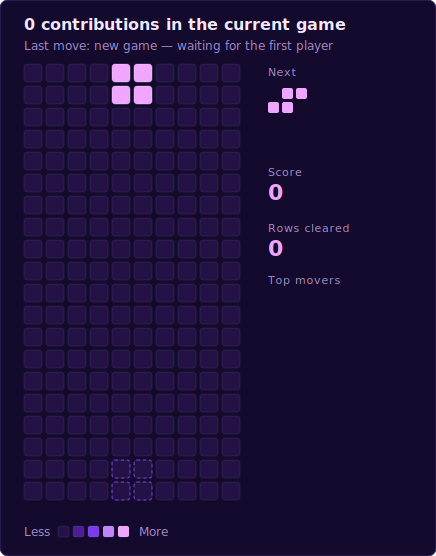

  

  
  
  
  

  <i>Building where quantitative rigor meets real-world impact — mathematics, computing, finance &amp; social good.</i>

---

### ✦ About

Undergraduate in Applied Mathematics + Statistics at Harvard University, interested in
the intersection of mathematics, computing, finance, and social impact.

### ✦ Contribution graph, animated

  
  

### ✦ Play Tetris on my graph

Anyone can play — click a move below, press **Submit** on the issue that opens, and a
GitHub Action plays it on the board in ~30 seconds. Prefer real-time?
**[▶️ Play the live version](https://RyanZWhalen.github.io/RyanZWhalen/)** with your keyboard.

  

| | | | | |
|:-:|:-:|:-:|:-:|:-:|
| [⬅️ **Left**](https://github.com/RyanZWhalen/RyanZWhalen/issues/new?title=tetris%7Cleft&body=Just+press+%22Submit+new+issue%22.+Your+move+will+play+automatically!) | [🔄 **Rotate**](https://github.com/RyanZWhalen/RyanZWhalen/issues/new?title=tetris%7Crotate&body=Just+press+%22Submit+new+issue%22.+Your+move+will+play+automatically!) | [➡️ **Right**](https://github.com/RyanZWhalen/RyanZWhalen/issues/new?title=tetris%7Cright&body=Just+press+%22Submit+new+issue%22.+Your+move+will+play+automatically!) | [⬇️ **Down**](https://github.com/RyanZWhalen/RyanZWhalen/issues/new?title=tetris%7Cdown&body=Just+press+%22Submit+new+issue%22.+Your+move+will+play+automatically!) | [💥 **Drop**](https://github.com/RyanZWhalen/RyanZWhalen/issues/new?title=tetris%7Cdrop&body=Just+press+%22Submit+new+issue%22.+Your+move+will+play+automatically!) |

Game over? [🆕 **Start a new game**](https://github.com/RyanZWhalen/RyanZWhalen/issues/new?title=tetris%7Cnew&body=Just+press+%22Submit+new+issue%22.)

**Current game:** <!--STATS:START-->**0** contributions · **0** rows cleared<!--STATS:END-->

**🏆 Top movers**

<!--LEADERBOARD:START-->
_No moves yet — be the first!_
<!--LEADERBOARD:END-->

---

  <i>Basketball · Alternative music · Chiikawa</i>

